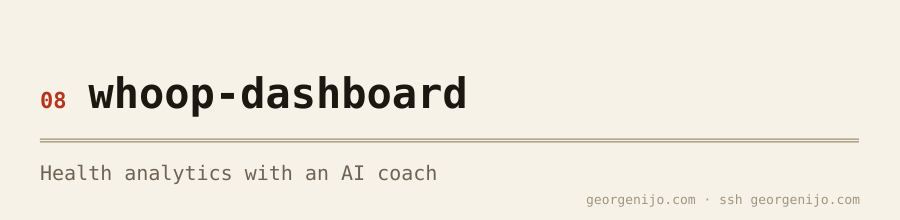
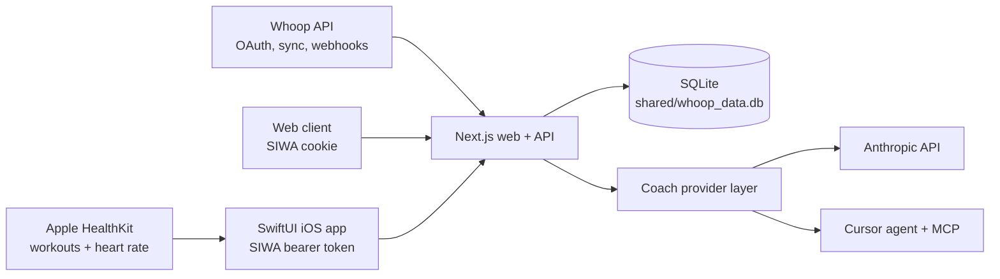

<picture><source media="(prefers-color-scheme: dark)" srcset="docs/banner-dark.svg"></picture>

# Whoop Dashboard

A personal health data hub for Whoop and Apple Health. The project combines a
Next.js web app, a native SwiftUI app, a multi-tenant SQLite store, and an
AI Coach that can analyze health data and author recovery-aware workout plans.

The web and iOS clients share the same authenticated `/api/*` backend. Whoop
data arrives through OAuth syncs and signed webhooks; HealthKit workouts arrive
from the iOS app and enrich or supplement the Whoop workout history.

This is an active, production-oriented personal project. The application is
multi-tenant, but the checked-in infrastructure and Apple identifiers are
specific to the current deployment rather than a turnkey hosted service.

## What it includes

- Recovery, sleep, strain, workout, trend, personal-record, and all-time
  analytics
- A persistent AI Coach with Anthropic and Cursor provider support, selectable
  models, configurable Anthropic reasoning effort, image attachments, and
  expandable work receipts
- Coach-authored workout plans that are shared between web and iOS
- Sign in with Apple for web cookies and iOS bearer sessions
- Per-user encrypted Whoop OAuth tokens and optional Anthropic/Cursor API keys
- Manual seven-day Whoop syncs, signed real-time webhooks, and a replayable
  webhook dead-letter queue
- HealthKit workout and heart-rate ingestion from iOS, including duplicate
  matching against Whoop workouts
- APNs device registration, structured server/client logs, web-vitals capture,
  and production build identity

## Architecture



SQLite is the canonical store. Domain rows, integrations, settings, chat
history, encrypted attachments, plans, logs, and device tokens all live in the
same database and are scoped by `user_id` where applicable.

## Stack

| Layer | Technology |
|---|---|
| Web and API | Next.js 16.2.4 App Router · React 19.2 · TypeScript 5 · Tailwind 4 |
| Native app | SwiftUI · iOS 17+ · Swift 5.9 · HealthKit · AuthenticationServices |
| Charts and UI | Recharts 3.8 · Lucide · Geist |
| Coach | Anthropic SDK 0.91 · Claude Sonnet 4.6 · Cursor model catalog and `cursor-agent` |
| Content and images | marked 18 · DOMPurify · Sharp |
| Data | SQLite WAL via better-sqlite3 12 |
| Auth and encryption | Sign in with Apple · JOSE · TweetNaCl secretbox |
| Operations | GitHub Actions · Tailscale · systemd · nginx · Oracle Cloud |

## Repository layout

```text
apps/
├── web/                 Next.js dashboard, API, sync, Coach, and DB layer
└── ios/                 SwiftUI app generated from project.yml with xcodegen
shared/                  Canonical SQLite database location
scripts/                 Deploy, Coach inspection, benchmarks, and migrations
streamlit/whoop/         Retained Python helpers for scripts and tests only
tests/                   Python helper tests
docs/                    Architecture, decisions, contracts, and operations
infra/terraform/         Owner-specific Oracle Cloud provisioning baseline
systemd/                 Active web unit plus retained legacy service files
prompts/                 Repository task and build prompts
```

`shared/whoop_data.db` and its WAL sidecars are intentionally gitignored.
`tokens.json` is a legacy, gitignored migration source; encrypted
`integrations` rows are the runtime source of truth.

## Local web development

### Prerequisites

- Node.js 20 and npm
- A Whoop developer application for OAuth and live sync
- Sign in with Apple web credentials for an interactive authenticated session
- At least one Coach credential: Anthropic, Cursor, or a per-user key added
  later in Settings
- Python 3 only if you need the retained migration utilities or Python tests

### Setup

```bash
git clone https://github.com/georgenijo/whoop-dashboard.git
cd whoop-dashboard

# The file is not committed. openWrite() owns schema creation and migrations,
# but intentionally refuses to create an absent database file.
test -e shared/whoop_data.db || touch shared/whoop_data.db

cp .env.example apps/web/.env.local
cd apps/web
npm ci
npm run dev
```

Open <http://localhost:3000>. Build and test commands do not require production
secrets, but using the application does require a valid authenticated user.

For a complete local flow:

1. Fill the Sign in with Apple, `JWT_SIGNING_KEY`, and `PUBLIC_ORIGIN`
   variables in `apps/web/.env.local`. For browser sign-in during local
   development, use a public HTTPS origin or tunnel registered with Apple.
2. Set the web Services ID callback to
   `${PUBLIC_ORIGIN}/api/auth/apple-web/callback`.
3. Add `WHOOP_CLIENT_ID`, `WHOOP_CLIENT_SECRET`, `WHOOP_STATE_SECRET`, and
   `VAULT_KEY`.
4. Set the Whoop developer callback to
   `http://localhost:3000/api/auth/callback`.
5. Configure `ANTHROPIC_API_KEY` and/or `CURSOR_API_KEY`. Cursor turns also
   require `cursor-agent` on the service path or
   `COACH_CURSOR_AGENT_BIN` set to its absolute path.
6. Sign in, complete the onboarding flow, connect Whoop, and run the first
   sync.

The auth proxy is dormant when `APPLE_SERVICES_ID` is unset so builds and
limited diagnostics remain possible, but protected pages and API routes still
have no development-user bypass.

See [`.env.example`](.env.example) for generation commands and
[the environment and deployment guide](docs/operations/environment-and-deploy.md)
for the full variable inventory and secret boundaries.

### Commands

Run web commands from `apps/web/`.

| Command | Purpose |
|---|---|
| `npm run dev` | Start the development server on port 3000 |
| `npm test` | Run the Vitest suite once |
| `npm run test:watch` | Run Vitest in watch mode |
| `npm run lint` | Run ESLint |
| `npm run build` | Build the Coach MCP bundle and production Next.js app |
| `npm run start` | Start a completed production build |
| `npm run build:mcp` | Build only the Cursor Coach MCP server |

The load-bearing DB test rejects unscoped SQL against the health-domain
tables. A production build is required before repository changes are merged.

### Optional Python helpers

```bash
python3 -m venv venv
source venv/bin/activate
pip install -r requirements.txt
pytest tests/
```

These dependencies support vault/integration tests, migrations, and maintenance
scripts. There is no active Python sync service or Streamlit UI.

## iOS development

The native app lives in `apps/ios/`. `Coach.xcodeproj` is generated and
gitignored; `project.yml` is the source of truth.

```bash
brew install xcodegen
cd apps/ios
xcodegen generate
open Coach.xcodeproj
```

Select the `Coach` scheme in Xcode and run it on an iOS 17+ simulator or signed
device. The app currently targets `https://coach-api.georgenijo.com` by default;
`APIClient.swift` and `ClientLogger.swift` own those endpoints. A Debug-only
`COACH_DEBUG_TOKEN` environment variable can seed a simulator session.

For the shared development simulator, use the launcher instead of signing in
with Apple:

```bash
apps/ios/scripts/run-dev-simulator.sh [simulator-udid]
```

The launcher mints a normal 30-day session inside `whoop-vm` over Tailscale,
validates it against the production API, builds a signed Debug app, and injects
the session only into that simulator process. It never prints the signing key or
session token, and Release builds continue to require Sign in with Apple. Set
`COACH_DEV_USER_ID` to target a different development user.

The iOS app provides Home, Trends, Stats, Coach, Plans, and Settings tabs.
Trends contains the Recovery, Sleep, Strain, and Workouts surfaces. It also
registers for push notifications and incrementally ingests HealthKit workouts
with anchored background delivery.

Xcode Cloud regenerates the project after cloning and archives changes under
`apps/ios/**` from `main`. See [the iOS CI guide](apps/ios/CI.md) for the
current workflow and signing identifiers.

## Web surfaces

| Path | Purpose |
|---|---|
| `/` | Recovery hero, KPI strip, AI insight, trends, and personal records |
| `/recovery` | Recovery, HRV/RHR, illness, rebound, and overtraining signals |
| `/sleep` | Sleep need, stages, debt, consistency, naps, and recovery relationships |
| `/strain` | Daily strain, training balance, heart rate, and today’s workouts |
| `/workouts` | Workout history, distance/zones, and detailed heart-rate analytics |
| `/stats` | All-time totals, yearly comparisons, sport mix, records, and monthly rollups |
| `/coach` | Persistent Coach threads, images, model picker, and tool work receipts |
| `/plans` | Coach-authored, recovery-aware workout plans |
| `/logs` | Unified sync, chat, route, server, client, and webhook diagnostics |
| `/perf` | Web performance metrics and recent measurements |
| `/settings` | Connections, Coach keys/model/prompt, preferences, and account controls |
| `/welcome` | First-run goals, Whoop connection, and initial sync |

## Coach

`POST /api/chat` supports streaming SSE and non-streaming JSON responses.
Conversations persist complete provider content blocks, tool calls/results,
encrypted image attachments, and a bounded user-visible work receipt. New
threads receive deterministic titles with an optional Haiku 4.5 refinement.

The shared tool layer contains:

- `query_recovery`
- `query_sleep`
- `query_strain`
- `query_workouts`
- `query_naps`
- `query_journal`
- `query_daily_snapshot`
- `query_workout_plans`
- `save_workout_plan`
- `trigger_whoop_sync`

The Anthropic loop can use the complete set. Cursor runs in a throwaway
per-turn workspace through a bundled stdio MCP server; it receives the scoped
query and plan tools plus `view_chat_image`, while manual sync remains outside
the Cursor MCP surface.

All data access is bound to the authenticated user. The Anthropic loop is
capped at eight tool iterations and 16,384 output tokens. Personal encrypted
keys take precedence over shared server fallbacks; Settings can validate,
store, mask, and remove both Anthropic and Cursor keys.

## Data and authentication flow

1. Sign in with Apple creates or resolves a user and issues a signed JWT. Web
   clients receive it in the `__Host-coach_session` cookie; iOS sends it as a
   bearer token.
2. Whoop OAuth carries the local user through an HMAC-signed state value.
   Access and refresh tokens are encrypted into the user’s `integrations` row.
3. `runWhoopSync({ userId })` fetches the latest seven days of cycles,
   recovery, sleep, workouts, and body measurements in parallel, then upserts
   tenant-scoped rows and recomputes `daily_summary`.
4. Signed Whoop webhooks map the provider user ID back to a local user and
   update or delete individual resources. Failures remain replayable in
   `webhook_events`.
5. The iOS HealthKit pipeline matches workouts by time and sport, enriches
   existing Whoop rows with heart-rate streams where possible, and inserts
   unmatched HealthKit-only workouts.
6. Web pages, iOS routes, and Coach tools read through the same user-scoped DB
   helpers.

The public auth exemptions are deliberately narrow: sign-in/auth callbacks,
the signed Whoop webhook, admin routes with their own bearer gate, static
assets, and build-only `/api/health`.

## Database rules

- Keep the canonical database at `shared/whoop_data.db`; use `WHOOP_DB_PATH`
  only when an environment intentionally stores it elsewhere.
- Schema changes live in `apps/web/src/lib/db/connection.ts` and run lazily
  through `openWrite()`.
- Domain reads go through `forUser(userId)`; direct unscoped domain SQL is
  blocked by tests.
- Only scored Whoop recovery, cycle, and sleep records are processed. Workouts
  do not use the same score-state gate.
- Naps are stored but excluded from nightly sleep queries.
- The database runs in WAL mode. Never back up a live deployment with a raw
  file copy; use SQLite’s online backup API.

## Production and deployment

Production runs `whoop-web.service` on port 8501 behind nginx and the
Cloudflare proxy. Cloudflare Access is not the application gate; Sign in with
Apple and the app’s JWT validation protect the web surface. The iOS API uses
the same Next.js routes with bearer authentication.

The GitHub workflow runs `npm ci`, `npm test`, `npm run build`, and a deploy
script syntax check for pull requests and `main`. When production deployment
is enabled, a verified push to `main` connects through ephemeral Tailscale
identity and calls:

```bash
scripts/deploy --ref "$GITHUB_SHA"
```

The deploy script creates and verifies an online SQLite backup, installs
dependencies, builds the exact commit, restarts systemd, checks `/signin`, and
confirms `/api/health` is serving the expected SHA. Deploys are serialized.

Manual operator commands:

```bash
scripts/deploy --check       # read-only checkout/build drift report
scripts/deploy               # deploy origin/main
scripts/deploy --ref <sha>   # deploy an exact revision
```

Do not reproduce the deploy sequence with ad hoc SSH commands. Runtime
application secrets stay on the VM and are not copied into GitHub Actions.

## Operations and debugging

`scripts/coach` is a read-only inspector for local or production Coach state:

```bash
scripts/coach login
scripts/coach threads --limit 10
scripts/coach thread 49 --tools
scripts/coach logs 49
scripts/coach syncs --status error
scripts/coach why 82
scripts/coach --local threads
scripts/coach logout
```

The Cursor latency harness is documented in
[`scripts/BENCH.md`](scripts/BENCH.md). Production configuration and recovery
procedures live in
[`docs/operations/environment-and-deploy.md`](docs/operations/environment-and-deploy.md).

## Legacy boundaries

- The Streamlit application and Python daily sync are retired.
  `streamlit/whoop/` remains only because Python migrations and tests share its
  vault/integration wire format.
- `tokens.json` is not read by the active application. It exists only as an
  input to the one-shot encrypted-token migration.
- `systemd/whoop-web.service` is the active application unit. The older
  Streamlit, Python sync, and tunnel units are retained as operational history
  and should not be treated as the current architecture.
- The rebuild documents under `docs/rebuild/` describe historical migration
  work, not current implementation guidance.

## Project guidance

Before changing code, read [`AGENTS.md`](AGENTS.md), the relevant nested agent
guidance, and the current Next.js documentation bundled under
`apps/web/node_modules/next/dist/docs/`. Architectural and process decisions
are recorded newest-first in
[`docs/decisions/DECISIONS.md`](docs/decisions/DECISIONS.md).

Repository changes must be made on a branch and merged through a pull request.
At minimum, web changes must pass:

```bash
cd apps/web
npm test
npm run build
```
